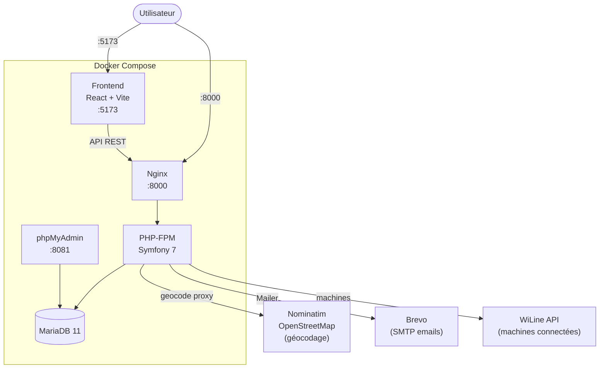
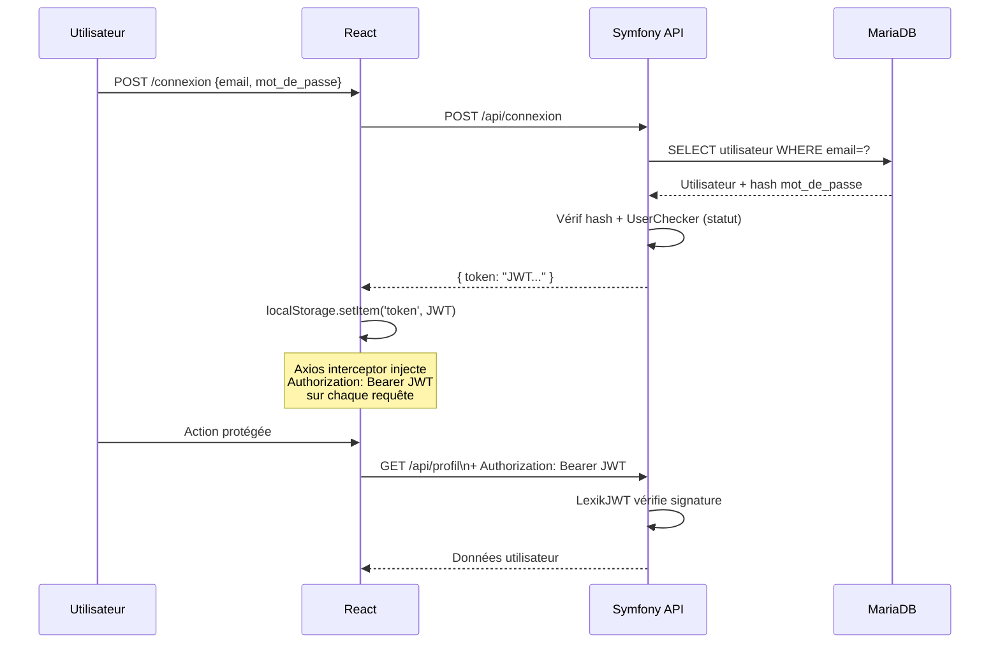
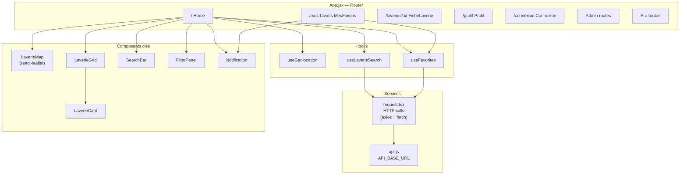
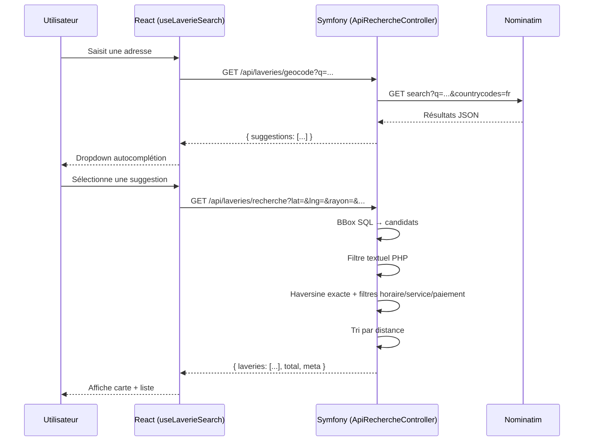
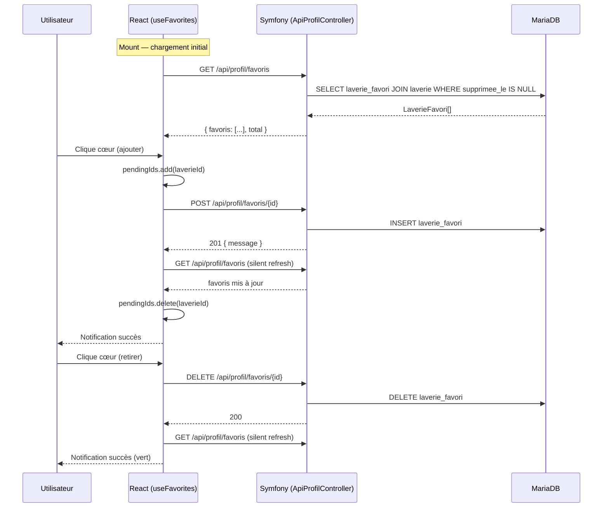
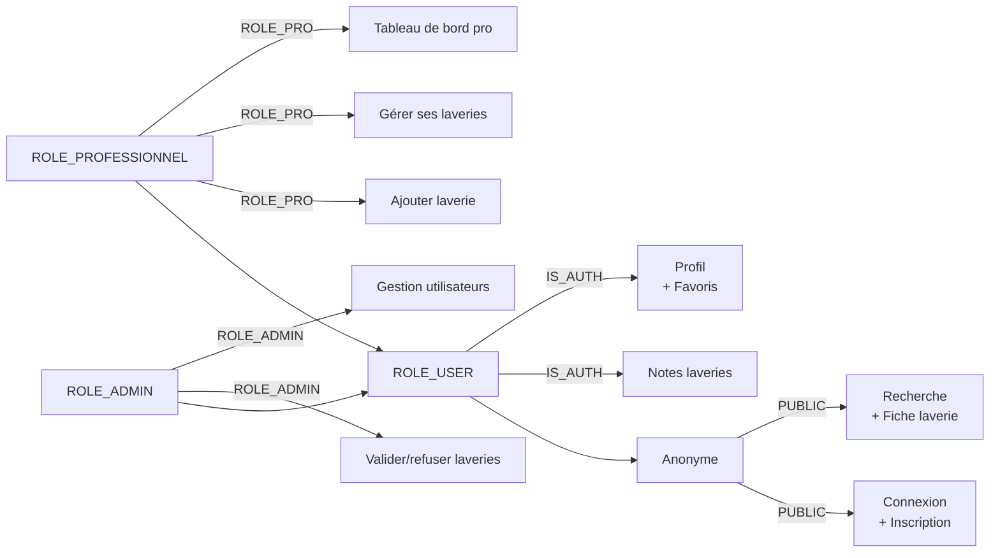

# LaundryMap — Architecture

## Infrastructure



---

## Flux d'authentification



---

## Schéma de la base de données

```mermaid
erDiagram
    UTILISATEUR {
        int id PK
        string email UK
        string nom
        string prenom
        string mot_de_passe
        enum statut
        datetime date_creation
        datetime date_modification
        datetime date_derniere_connexion
        datetime utilisateur_supprime_le
        string oauth_id
    }

    PROFESSIONNEL {
        int id PK
        int utilisateur_id FK
        string nom
        string prenom
        string email
        string siret
        enum statut
        int photo_profil_id FK
    }

    LAVERIE {
        int id PK
        int professionnel_id FK
        int adresse_id FK
        int logo_id FK
        string nom_etablissement
        string contact_email
        text description
        enum statut
        int wi_line_reference
        datetime date_ajout
        datetime date_modification
        datetime supprimee_le
    }

    ADRESSE {
        int id PK
        string adresse
        string code_postal
        string ville
        string pays
        float latitude
        float longitude
    }

    LAVERIE_FAVORI {
        int laverie_id PK,FK
        int utilisateur_id PK,FK
    }

    LAVERIE_NOTE {
        int id PK
        int laverie_id FK
        int utilisateur_id FK
        int note
        text commentaire
        datetime date
    }

    LAVERIE_FERMETURE {
        int id PK
        int laverie_id FK
        enum jour
        time heure_debut
        time heure_fin
    }

    LAVERIE_EQUIPEMENT {
        int id PK
        int laverie_id FK
        string nom
        string type
        int capacite
        float tarif
        int duree
        int equipement_reference
    }

    LAVERIE_MEDIA {
        int id PK
        int laverie_id FK
        int media_id FK
    }

    LAVERIE_SERVICE {
        int id PK
        int laverie_id FK
        int service_id FK
    }

    LAVERIE_PAIEMENT {
        int id PK
        int laverie_id FK
        int methode_paiement_id FK
    }

    MEDIA {
        int id PK
        string emplacement
        string nom_originel
        string mime_type
        int poids
    }

    SERVICE { int id PK; string nom }
    METHODE_PAIEMENT { int id PK; string nom }

    UTILISATEUR ||--o| PROFESSIONNEL : "est"
    PROFESSIONNEL ||--o{ LAVERIE : "possède"
    LAVERIE }o--|| ADRESSE : "se trouve à"
    LAVERIE }o--o| MEDIA : "logo"
    UTILISATEUR ||--o{ LAVERIE_FAVORI : "met en favori"
    LAVERIE ||--o{ LAVERIE_FAVORI : "est favori de"
    UTILISATEUR ||--o{ LAVERIE_NOTE : "écrit"
    LAVERIE ||--o{ LAVERIE_NOTE : "reçoit"
    LAVERIE ||--o{ LAVERIE_FERMETURE : "horaires"
    LAVERIE ||--o{ LAVERIE_EQUIPEMENT : "machines"
    LAVERIE ||--o{ LAVERIE_MEDIA : "photos"
    LAVERIE ||--o{ LAVERIE_SERVICE : "offre"
    LAVERIE ||--o{ LAVERIE_PAIEMENT : "accepte"
    LAVERIE_MEDIA }o--|| MEDIA : "fichier"
    LAVERIE_SERVICE }o--|| SERVICE : "réf."
    LAVERIE_PAIEMENT }o--|| METHODE_PAIEMENT : "réf."
```

---

## Architecture frontend



---

## Flux de recherche de laveries



---

## Flux favoris



---

## Rôles et accès


